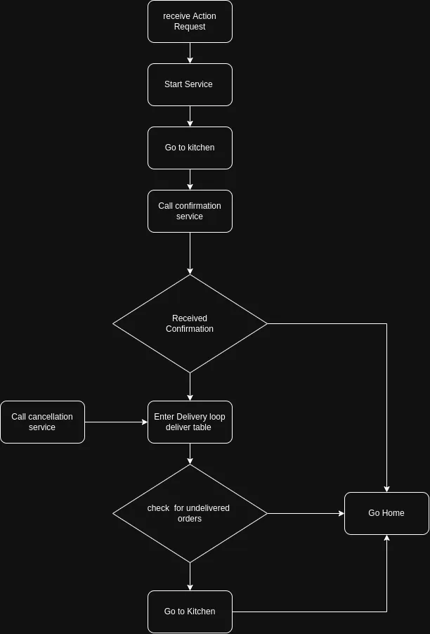

# Butler Robot 

## Requirements
 - ROS 2 Humble
 - Gazebo Fortress
 - [Navigation 2](https://navigation.ros.org/build_instructions/index.html#install)
   
## Requirements for setting up gazebo robot simulation package
link to original package : [Github Repo](https://github.com/art-e-fact/navigation2_ignition_gazebo_example)

### inside navigation2_ignition_gazebo_example

setup and build
```

# Install Nav2 dependencies
sudo apt install ros-humble-navigation2 ros-humble-nav2-bringup

# Import source dependencies
pip3 install vcstool
vcs import --input deps.repos src

# Install rosrep dependencies
rosdep install -y -r -i  --from-paths . 

```

## Usage

run gazebo simulation and robot manager node :

```
ros2 launch butler_bot butler_bot.launch.py
```

run the service node that starts takes input from user in terminal to emulate confirmations

```
ros2 run butler_bot conf_server 
```

send order to robot manager node by calling the `action`

```
ros2 action send_goal /take_order butler_interfaces/action/TableOrder '{order: ["table1", "table2", "table3"]}' --feedback
```

To cancel orders call service with table name

```
ros2 service call /cancel_order butler_interfaces/srv/CancelOrder '{tableid: "table3"}'
```

## Code Breakdown

### `conf_server.py`
This file defines a ROS 2 service server that handles two services: `kitchen_conf` and `table_conf`. It allows the user to emulate confirmations for kitchen orders and table statuses via terminal input.

- **Key Components**:
  - **`ConfServer` Class**:
    - `handle_kitchen_request`: Processes kitchen order requests and prompts the user to enter ready orders.
    - `handle_table_request`: Processes table requests and prompts the user to confirm the table status.
    - `input_with_timeout`: Waits for user input with a timeout to ensure responsiveness.
  - **Usage**:
    - Run the service node:  
      ```bash
      ros2 run butler_bot conf_server
      ```

### `robot_manager.py`
This file defines a ROS 2 action server that manages robot navigation and order delivery. It interacts with the `conf_server` via services and handles order cancellations.

- **Key Components**:
  - **`ButlerActionServer` Class**:
    - `execute_callback`: Main logic for handling orders, including navigation to the kitchen, delivering orders to tables, and handling cancellations.
    - `go_to_destination`: Commands the robot to navigate to a specific location.
    - `get_kitchen_conf` and `get_table_conf`: Interact with the `conf_server` to confirm kitchen readiness and table delivery.
    - `cancel_order_callback`: Handles order cancellation requests.
  - **Usage**:
    - Send an order to the robot manager node:  
      ```bash
      ros2 action send_goal /take_order butler_interfaces/action/TableOrder '{order: ["table1", "table2", "table3"]}' --feedback
      ```
    - Cancel an order:  
      ```bash
      ros2 service call /cancel_order butler_interfaces/srv/CancelOrder '{tableid: "table3"}'
      ```

## Demo Video

[](https://youtu.be/OeQ2RmKH4vA)


Simple delivery video 


[](https://youtu.be/WktzcJttmdk)

Delivery cancel video 

## FLOW SHEET


